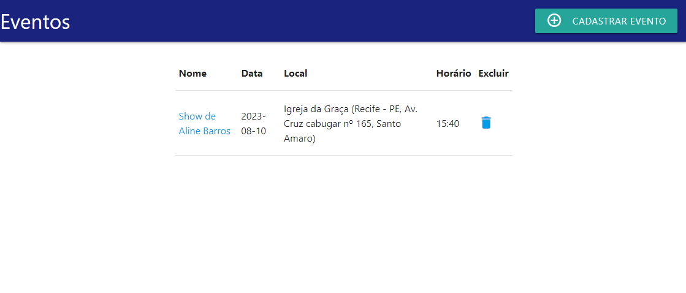

# Sistema <EventoApp>
## Descrição:

É um sistema para cadastrar eventos e seus respectivos convidados, com o objetivo de ter um maior controle e organização dos dados de cada evento.

## Programas/Bibliotecas

### Arquitetura

* MVC

### Back-End

* Linguagem Java
* JDK 17
* Spring boot com Thymeleaf
* Banco Postgresql
* Gerenciador de dependências Maven

### Front-End

* HTML 5
* CSS 3
* JAVA SCRIPT
* MATERIALIZE
* JQUERY

### <DEPENDÊNCIAS>

```xml
<!-- JPA -->
<dependency>
    <groupId>org.springframework.boot</groupId>
    <artifactId>spring-boot-starter-data-jpa</artifactId>
</dependency>

<!-- thymeleaf -->
<dependency>
    <groupId>org.springframework.boot</groupId>
    <artifactId>spring-boot-starter-thymeleaf</artifactId>
</dependency>

<!-- Postgresql -->
<dependency>
    <groupId>org.postgresql</groupId>
    <artifactId>postgresql</artifactId>
    <scope>runtime</scope>
</dependency> 
<!-- ########################################################################################### -->
<!-- Plugin: serve para evitar conflico com o maven -->
<plugin>
    <groupId>org.apache.maven.plugins</groupId>
    <artifactId>maven-resources-plugin</artifactId>
    <version>3.1.0</version> <!--$NO-MVN-MAN-VER$ -->
</plugin><!-- este plugin evita bug de incompatibilidade -->	
```

## Modelo de Domínio


## Modelo de Objeto


## Tela Inicial do Sistema

O sistema carregado vai ter esta tela, não está mostrando nenhum evento pois precisa cadastrar um evento para poder ser listado na tela Inicial de Eventos. Pois clicando no botão "Cadastrar Evento", vai ser redirecionado para a tela Cadastrar.


## Tela Cadastrar Evento

Está tela será responsável por cadastrar os eventos do usuário. Onde o mesmo preenche os campos abaixo e aperta no botão cadastrar e o sistema vai cadastrar o evento. Depois o usuário pode clicar no botão cadastros e será redirecionado para a tela Inicial do Sistema que Lista todos  eventos.


## Tela inicial do Sistema que Lista os Eventos

Nesta tela será listados todos os eventos juntamente com um botão de excluir evento caso o usuário deseje o fazer. Ressaltando informar que se tiver algum convidado vinculado a este evento o mesmo não poderá ser excluído. Para ver o detalhe do evento que mostra seus respectivos convidados será necessário clicar no nome do evento e o sistema redirecionara para a tela de "Detalhe Eventos". 



## Tela de Detalhe Evento

Nesta tela será exibido os dados do evento e também um formulário para poder cadastrar os convidados de cada evento cadastrado. Ao preencher os campos e clicar no botão adicionar, o usuário estará adicionando convidados ao evento, podendo também excluir o convidado clicando no botão excluir. Lembrando que para se excluir um evento na tela inicial da listagem de eventos será necessário excluir todos os convidados para depois excluir o evento na tela inicial de listagem de eventos. Clicando no botão cadastros será redirecionado para a tela Inicial do sistema onde contem todos os eventos cadastrados. 


